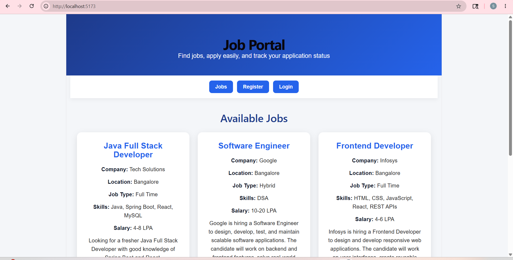
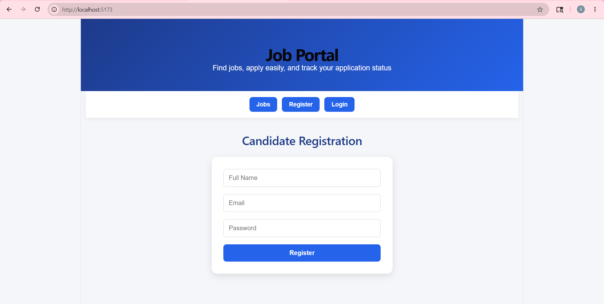
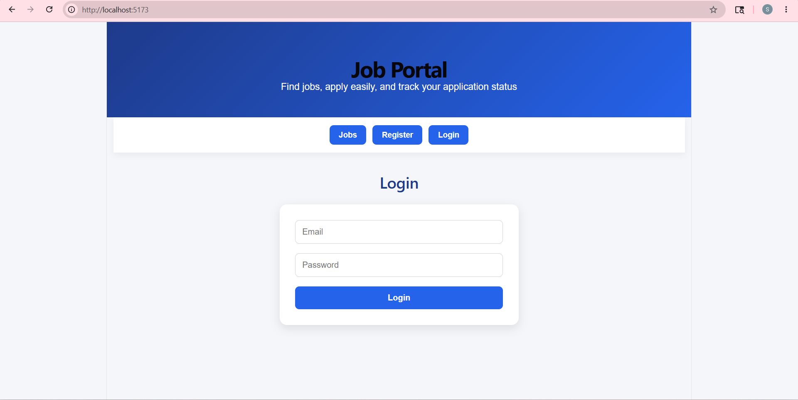
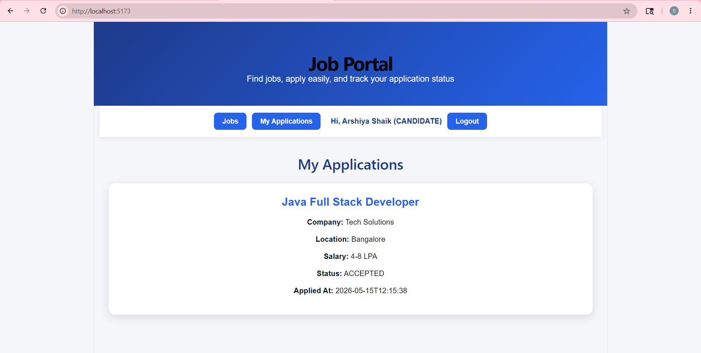
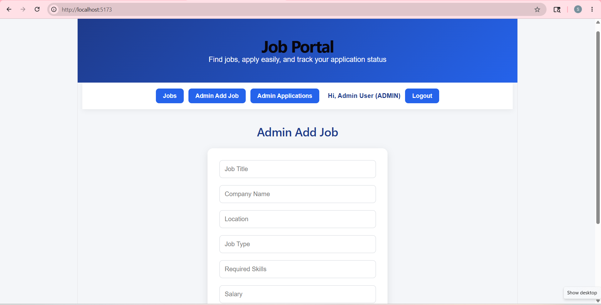
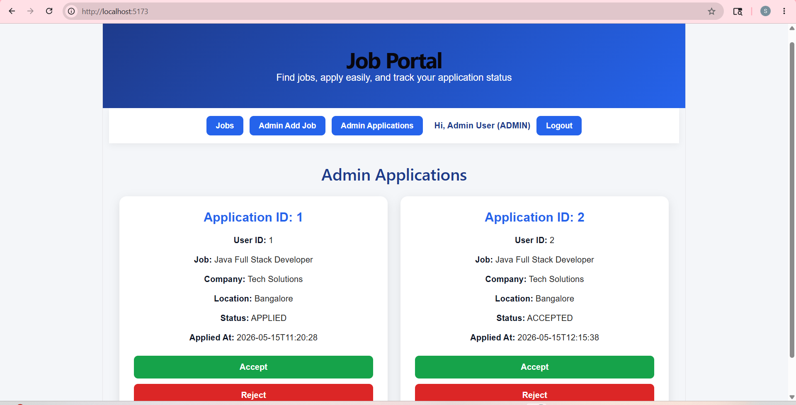
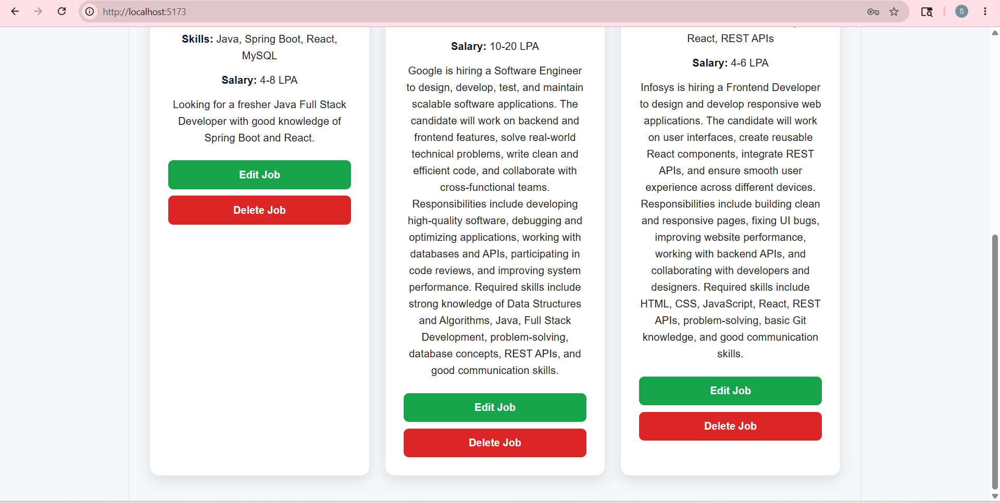

# Job Portal Web Application

A full-stack Job Portal web application built using **Java, Spring Boot, React, and MySQL**.  
This project allows candidates to register, login, view jobs, apply for jobs, and track application status.  
Admin users can add, edit, delete jobs, view candidate applications, and accept or reject applications.

## Features

### Candidate Features
- Candidate registration
- Candidate login
- View available jobs
- Apply for jobs
- View applied jobs
- Track application status such as APPLIED, ACCEPTED, or REJECTED

### Admin Features
- Admin login
- Add new jobs
- Edit existing jobs
- Delete jobs
- View candidate applications
- Accept or reject applications
- Role-based access for admin and candidate users

## Technologies Used

### Backend
- Java
- Spring Boot
- Spring Data JPA
- REST APIs
- MySQL
- Maven

### Frontend
- React
- JavaScript
- HTML
- CSS
- Vite

### Tools
- Visual Studio Code
- Postman
- MySQL
- Git
- GitHub

## Project Structure

```text
Job-Portal-Project
│
├── backend
│   └── job-portal-api
│       ├── src
│       ├── pom.xml
│       └── application.properties
│
├── frontend
│
├── job-portal-frontend
│   ├── src
│   │   ├── App.jsx
│   │   ├── App.css
│   │   └── main.jsx
│   ├── package.json
│   └── index.html
│
├── screenshots
│   ├── 01-job-page.png
│   ├── 02-register-page.png
│   ├── 03-login-page.png
│   ├── 04-my-application.png
│   ├── 05-admin-add-job.png
│   ├── 06-admin-application.png
│   └── 07-admin-job-management.png
│
└── README.md

API Endpoints
Authentication APIs
Method	Endpoint	Description
POST	/api/auth/register	Register a new user
POST	/api/auth/login	Login user
Job APIs
Method	Endpoint	Description
GET	/api/jobs	Get all jobs
POST	/api/jobs	Add a new job
PUT	/api/jobs/{id}	Update job
DELETE	/api/jobs/{id}	Delete job
Application APIs
Method	Endpoint	Description
POST	/api/applications/apply	Apply for a job
GET	/api/applications/user/{userId}	Get candidate applications
GET	/api/applications	Get all applications
PUT	/api/applications/{id}/status?status=ACCEPTED	Accept application
PUT	/api/applications/{id}/status?status=REJECTED	Reject application

## Screenshots

### Jobs Page


### Candidate Registration


### Candidate Login


### My Applications


### Admin Add Job


### Admin Applications


### Admin Job Management


How to Run the Project
Backend Setup
Open the backend project in Visual Studio Code.
Go to the backend folder:
cd backend/job-portal-api/job-portal-api
Configure MySQL database in application.properties.

Example:

spring.datasource.url=jdbc:mysql://localhost:3306/job_portal_db
spring.datasource.username=root
spring.datasource.password=your_password
spring.jpa.hibernate.ddl-auto=update
spring.jpa.show-sql=true
server.port=8080
Run the Spring Boot application:
mvn spring-boot:run

Backend will run on:

http://localhost:8080
Frontend Setup
Go to the frontend folder:
cd frontend/job-portal-frontend
Install dependencies:
npm install
Start React application:
npm run dev

Frontend will run on:

http://localhost:5173
Testing with Postman
Register Candidate
{
  "fullName": "Arshiya Shaik",
  "email": "arshiya@gmail.com",
  "password": "12345",
  "role": "CANDIDATE"
}
Register Admin
{
  "fullName": "Admin User",
  "email": "admin@gmail.com",
  "password": "admin123",
  "role": "ADMIN"
}
Add Job
{
  "title": "Java Full Stack Developer",
  "company": "Tech Solutions",
  "location": "Bangalore",
  "jobType": "Full Time",
  "skills": "Java, Spring Boot, React, MySQL",
  "salary": "4-8 LPA",
  "description": "Looking for a fresher Java Full Stack Developer with good knowledge of Spring Boot and React."
}

Author
Arshiya Shaik
